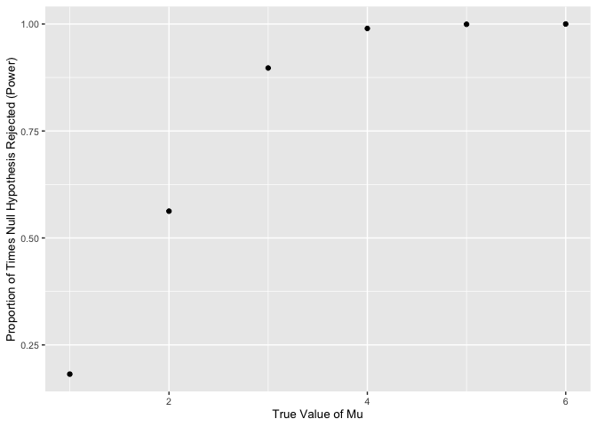

P8105 Homework 5 si2426
================
Shodai Inose
2022-11-16

## Problem 2

#### Loading Data and Creating a Summary

``` r
homicide_df = read.csv("./data/homicide-data.csv") %>% 
transform(
  state,
  state = replace(state, (city == "Tulsa" & state == "AL"), "OK")
) %>%
  select(-"c..NM....NM....NM....NM....NM....NM....NM....NM....NM....NM...") %>%
  mutate(victim_age = as.integer(victim_age),
         victim_race = as.factor(victim_race),
         victim_sex = as.factor(victim_sex))
```

The raw data contains 52179 observations and 12 variables. The key
variables are `uid`, `reported_date`, `victim_last`, `victim_first`,
`victim_race`, `victim_age`, `victim_sex`, `city`, `state`, `lat`,
`lon`, and `disposition.` The dataset contains information from 28
distinct states. The original data contains a likely typo of a city
named Tulsa, Alabama. As there are no cities or towns in Alabama with
the name Tulsa, this error has been corrected to Tulsa, Oklahoma.

``` r
homicide_df = homicide_df %>% 
  mutate(city_state = paste(city, state, sep = ", "))

homicide_summary = homicide_df %>% 
  group_by(city_state) %>% 
  summarize(total_homicide = n(), unsolved_homicides = sum(disposition == "Closed without arrest" | disposition == "Open/No arrest"))

head(homicide_summary, 5) %>% 
  knitr::kable()
```

| city_state      | total_homicide | unsolved_homicides |
|:----------------|---------------:|-------------------:|
| Albuquerque, NM |            378 |                146 |
| Atlanta, GA     |            973 |                373 |
| Baltimore, MD   |           2827 |               1825 |
| Baton Rouge, LA |            424 |                196 |
| Birmingham, AL  |            800 |                347 |

#### Proportion of Unsolved Homicides in Baltimore, MD

``` r
baltimoreptest = 
  prop.test(homicide_summary %>% 
                             filter(city_state == "Baltimore, MD") %>%
                             pull(unsolved_homicides), homicide_summary %>%
                             filter(city_state == "Baltimore, MD") %>%
                             pull(total_homicide))

baltimoreptest = baltimoreptest %>% 
  broom::tidy()

baltimoreptest_estimate = round(baltimoreptest %>% 
                                  pull(estimate), 2)

baltimoreptest_low = round(baltimoreptest %>% 
                             pull(conf.low), 2)
baltimoreptest_high = round(baltimoreptest %>% 
                              pull(conf.high), 2)
```

The estimated proportion is approximately 0.65 and the 95% confidence
interval is (0.63, 0.66).

#### Proportion of Unsolved Homicides in All Cities

``` r
homicide_sum = homicide_summary %>% 
  mutate(
    prop_test = map2(
        homicide_summary$unsolved_homicides,
        homicide_summary$total_homicide, prop.test), 
    results = map(prop_test, broom::tidy)
    ) %>% 
  unnest(results) %>% 
  select(-c(prop_test, parameter, method, alternative)) %>%
  mutate(city_state = fct_reorder(city_state, estimate))

head(homicide_sum) %>% 
  knitr::kable()
```

| city_state      | total_homicide | unsolved_homicides |  estimate |   statistic |   p.value |  conf.low | conf.high |
|:----------------|---------------:|-------------------:|----------:|------------:|----------:|----------:|----------:|
| Albuquerque, NM |            378 |                146 | 0.3862434 |  19.1137566 | 0.0000123 | 0.3372604 | 0.4375766 |
| Atlanta, GA     |            973 |                373 | 0.3833505 |  52.4933196 | 0.0000000 | 0.3528119 | 0.4148219 |
| Baltimore, MD   |           2827 |               1825 | 0.6455607 | 239.0109657 | 0.0000000 | 0.6275625 | 0.6631599 |
| Baton Rouge, LA |            424 |                196 | 0.4622642 |   2.2665094 | 0.1321974 | 0.4141987 | 0.5110240 |
| Birmingham, AL  |            800 |                347 | 0.4337500 |  13.7812500 | 0.0002054 | 0.3991889 | 0.4689557 |
| Boston, MA      |            614 |                310 | 0.5048860 |   0.0407166 | 0.8400859 | 0.4646219 | 0.5450881 |

#### Plotting the Proportions of Unsolved Homicides

``` r
ggplot(homicide_sum, aes(x = city_state, y = estimate)) + 
  geom_point() + 
  geom_errorbar(aes(ymin = conf.low, ymax = conf.high)) +
  labs(x = "City, State", y = "Proportion of Unsolved Homicides") +
  theme(axis.text.x = element_text(angle = 90, vjust = 0.5, hjust = 1))
```

<!-- -->

From the graph above, we note that Richmond, Virginia has the lowest
estimated proportion of unsolved homicides while Chicago, Illinois has
the highest estimated proportion proportion of unsolved homicides. It
should be noted that the confidence interval for the proportion of
unsolved homicides in Chicago is much higher than the confidence
intervals in other cities. Since the confidence interval for Chicago
does not overlap with any other confidence intervals, it indicates a
significant difference between the proportion of unsolved homicides in
Chicago and all other cities.

## Problem 3

#### Simulating $\mu$ = 0

``` r
create_simulation = function(n = 30, mu, sigma = 5) 
  {
  simulation_results = tibble(
    x = rnorm(n = n, mean = mu, sd = sigma),
  )
  }

mu_0_df = 
  expand_grid(
    sample_size = 30,
    iter = 1:5000
  ) %>% 
  mutate(
    estimate_df = map(sample_size, ~create_simulation(mu = 0))
  ) %>% 
  group_by(iter) %>%
  mutate(
    mean = map_dbl(.x = estimate_df, ~mean(.x$x)),
    t_test = map(.x = estimate_df, ~t.test(.x$x)),
    results = map(t_test, broom::tidy)
    ) 

clean_t_test = function(x) 
  {
   x %>% unnest(results) %>% 
  dplyr::select(
    -c("estimate_df", "t_test", "parameter", "method", "alternative", "estimate")) %>%
    mutate(null_rejected = as.logical(ifelse(p.value > 0.05, 0, 1)))
  }

mu_0_df = mu_0_df %>% clean_t_test

head(mu_0_df, 5) %>% 
  knitr::kable()
```

| sample_size | iter |       mean |  statistic |   p.value |  conf.low | conf.high | null_rejected |
|------------:|-----:|-----------:|-----------:|----------:|----------:|----------:|:--------------|
|          30 |    1 |  0.3979108 |  0.5204655 | 0.6066903 | -1.165726 |  1.961548 | FALSE         |
|          30 |    2 |  0.1753150 |  0.2407882 | 0.8114135 | -1.313792 |  1.664422 | FALSE         |
|          30 |    3 | -0.2975351 | -0.3201209 | 0.7511718 | -2.198466 |  1.603396 | FALSE         |
|          30 |    4 |  0.2768135 |  0.2849465 | 0.7777103 | -1.710041 |  2.263668 | FALSE         |
|          30 |    5 | -0.5340273 | -0.4754918 | 0.6379986 | -2.831035 |  1.762981 | FALSE         |

#### Simulating Different Values of $\mu$

``` r
combined_mu_df = vector("list", 6)

for(i in 1:6)
{
  combined_mu_df[[i]] = (expand_grid(
    sample_size = 30,
    iter = 1:5000
  ) %>% 
  mutate(
    estimate_df = map(sample_size, ~create_simulation(mu = i))
  ) %>% 
  group_by(iter) %>%
  mutate(
    mu = i,
    mean = map_dbl(.x = estimate_df, ~mean(.x$x)),
    t_test = map(.x = estimate_df, ~t.test(.x$x)),
    results = map(t_test, broom::tidy)
    ) %>% 
    clean_t_test)
}

combined_mu_df = combined_mu_df %>% do.call(rbind, .)

head(combined_mu_df) %>% 
  knitr::kable()
```

| sample_size | iter |  mu |       mean |  statistic |   p.value |   conf.low | conf.high | null_rejected |
|------------:|-----:|----:|-----------:|-----------:|----------:|-----------:|----------:|:--------------|
|          30 |    1 |   1 | -0.9612061 | -1.0403046 | 0.3067944 | -2.8509289 | 0.9285167 | FALSE         |
|          30 |    2 |   1 |  0.3076869 |  0.3156362 | 0.7545391 | -1.6860338 | 2.3014076 | FALSE         |
|          30 |    3 |   1 |  0.1165000 |  0.1266977 | 0.9000541 | -1.7641126 | 1.9971126 | FALSE         |
|          30 |    4 |   1 |  1.2971497 |  1.6122208 | 0.1177453 | -0.3483873 | 2.9426867 | FALSE         |
|          30 |    5 |   1 |  1.3623081 |  1.4969086 | 0.1452227 | -0.4990166 | 3.2236327 | FALSE         |
|          30 |    6 |   1 |  0.6821793 |  0.8171570 | 0.4205016 | -1.0252199 | 2.3895785 | FALSE         |

#### Proportion of Times Null Rejected

``` r
null_reject_df = combined_mu_df %>% 
  group_by(mu) %>% 
  summarize(null_rejected_freq = sum(null_rejected)/n())

ggplot(null_reject_df, aes(x = mu, y = null_rejected_freq)) + 
  geom_point() +
  labs(x = "True Value of Mu", y = "Proportion of Times Null Hypothesis Rejected (Power)") + 
  theme(text = element_text(size = 10))
```

<!-- -->

The plot above indicates that the power of the test increases with the
effect size. For smaller effect sizes, the power quickly increases with
an increase in effect size. However, the relationship between effect
size and power slows as power approaches a value of 1. This occurs
because as the true value of $\mu$ increases further away from the
hypothesized value (which is 0 in this case), the null hypotheses of the
samples are more likely to be rejected.

``` r
mean_estimate_df = combined_mu_df %>% 
  group_by(mu) %>%
  summarize(mean_estimate = mean(mean))

rejected_mean_estimate_df = combined_mu_df %>% 
  filter(null_rejected == 1) %>%
  group_by(mu) %>%
  summarize(mean_estimate = mean(mean))

ggplot(mean_estimate_df, aes(x = mu, y = mean_estimate)) + 
  geom_point(aes(color = "b", shape = 'b', size = 'b')) + 
  geom_point(
    data = rejected_mean_estimate_df, aes(color = "a", shape = 'a', size = 'a')) +
  labs(x = "True Value of Mu", y = "Mean of Estimate of Mu", color = "Legend") +
    scale_color_manual(name = 'Type of Sample', 
                     values = c('b' = 'black','a' = 'red'), 
                     labels = c('All','Null Hypothesis Rejected')) + 
    scale_shape_manual(name = 'Type of Sample',
                       labels = c('All','Null Hypothesis Rejected'),
      values = c('b' = 19, 'a' = 17)) + 
      scale_size_manual(name = 'Type of Sample',
                       labels = c('All','Null Hypothesis Rejected'),
      values = c('b' = 3, 'a' = 2))
```

<!-- -->

The red marks represent the average estimated values of $\hat{\mu}$ in
samples for which the null was rejected. For the smaller values of
$\hat{\mu}$, these differ greatly from the average estimated values of
$\hat{\mu}$ for all samples. The black dots represent the average
estimated values of $\hat{\mu}$ for all samples. The black dots are much
more accurate to the true value of $\mu$ than the red marks. This is not
surprising, as the samples where the null was rejected indicate that the
estimated value of $\mu$ was very different from the true value.
